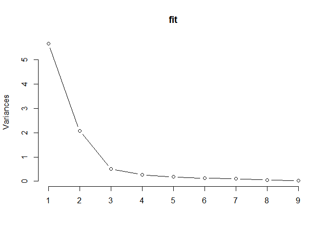
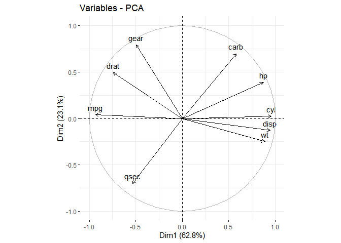
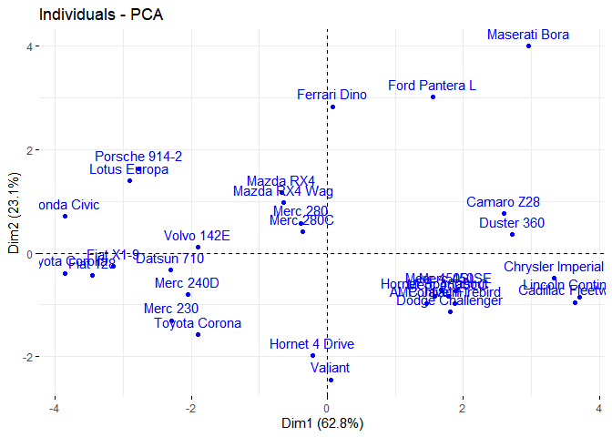
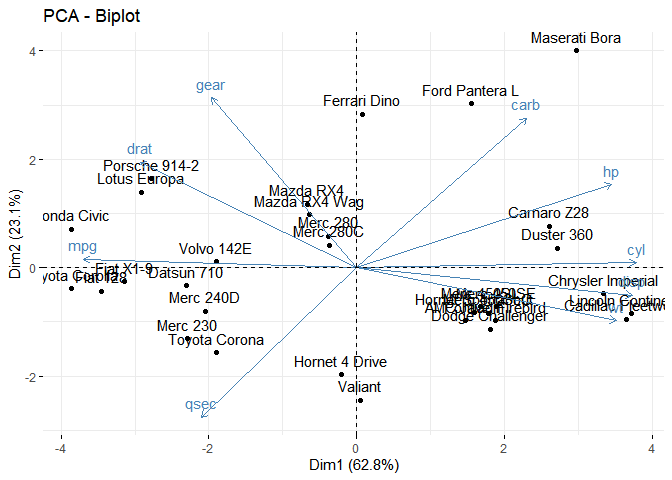

Untitled
================

``` r
load("D:/MS/STA 541 (Multivariate Statistical Methods)/PCcars.Rdata")
x=PCcars
x
```

    ##                      mpg cyl  disp  hp drat    wt  qsec gear carb
    ## Mazda RX4           21.0   6 160.0 110 3.90 2.620 16.46    4    4
    ## Mazda RX4 Wag       21.0   6 160.0 110 3.90 2.875 17.02    4    4
    ## Datsun 710          22.8   4 108.0  93 3.85 2.320 18.61    4    1
    ## Hornet 4 Drive      21.4   6 258.0 110 3.08 3.215 19.44    3    1
    ## Hornet Sportabout   18.7   8 360.0 175 3.15 3.440 17.02    3    2
    ## Valiant             18.1   6 225.0 105 2.76 3.460 20.22    3    1
    ## Duster 360          14.3   8 360.0 245 3.21 3.570 15.84    3    4
    ## Merc 240D           24.4   4 146.7  62 3.69 3.190 20.00    4    2
    ## Merc 230            22.8   4 140.8  95 3.92 3.150 22.90    4    2
    ## Merc 280            19.2   6 167.6 123 3.92 3.440 18.30    4    4
    ## Merc 280C           17.8   6 167.6 123 3.92 3.440 18.90    4    4
    ## Merc 450SE          16.4   8 275.8 180 3.07 4.070 17.40    3    3
    ## Merc 450SL          17.3   8 275.8 180 3.07 3.730 17.60    3    3
    ## Merc 450SLC         15.2   8 275.8 180 3.07 3.780 18.00    3    3
    ## Cadillac Fleetwood  10.4   8 472.0 205 2.93 5.250 17.98    3    4
    ## Lincoln Continental 10.4   8 460.0 215 3.00 5.424 17.82    3    4
    ## Chrysler Imperial   14.7   8 440.0 230 3.23 5.345 17.42    3    4
    ## Fiat 128            32.4   4  78.7  66 4.08 2.200 19.47    4    1
    ## Honda Civic         30.4   4  75.7  52 4.93 1.615 18.52    4    2
    ## Toyota Corolla      33.9   4  71.1  65 4.22 1.835 19.90    4    1
    ## Toyota Corona       21.5   4 120.1  97 3.70 2.465 20.01    3    1
    ## Dodge Challenger    15.5   8 318.0 150 2.76 3.520 16.87    3    2
    ## AMC Javelin         15.2   8 304.0 150 3.15 3.435 17.30    3    2
    ## Camaro Z28          13.3   8 350.0 245 3.73 3.840 15.41    3    4
    ## Pontiac Firebird    19.2   8 400.0 175 3.08 3.845 17.05    3    2
    ## Fiat X1-9           27.3   4  79.0  66 4.08 1.935 18.90    4    1
    ## Porsche 914-2       26.0   4 120.3  91 4.43 2.140 16.70    5    2
    ## Lotus Europa        30.4   4  95.1 113 3.77 1.513 16.90    5    2
    ## Ford Pantera L      15.8   8 351.0 264 4.22 3.170 14.50    5    4
    ## Ferrari Dino        19.7   6 145.0 175 3.62 2.770 15.50    5    6
    ## Maserati Bora       15.0   8 301.0 335 3.54 3.570 14.60    5    8
    ## Volvo 142E          21.4   4 121.0 109 4.11 2.780 18.60    4    2

``` r
fit=prcomp(x, scale=TRUE)
fit
```

    ## Standard deviations (1, .., p=9):
    ## [1] 2.3782219 1.4429485 0.7100809 0.5148082 0.4279704 0.3518426 0.3241326
    ## [8] 0.2418962 0.1489644
    ## 
    ## Rotation (n x k) = (9 x 9):
    ##             PC1         PC2         PC3          PC4        PC5         PC6
    ## mpg  -0.3931477  0.02753861 -0.22119309 -0.006126378 -0.3207620  0.72015586
    ## cyl   0.4025537  0.01570975 -0.25231615  0.040700251  0.1171397  0.22432550
    ## disp  0.3973528 -0.08888469 -0.07825139  0.339493732 -0.4867849 -0.01967516
    ## hp    0.3670814  0.26941371 -0.01721159  0.068300993 -0.2947317  0.35394225
    ## drat -0.3118165  0.34165268  0.14995507  0.845658485  0.1619259 -0.01536794
    ## wt    0.3734771 -0.17194306  0.45373418  0.191260029 -0.1874822 -0.08377237
    ## qsec -0.2243508 -0.48404435  0.62812782 -0.030329127 -0.1482495  0.25752940
    ## gear -0.2094749  0.55078264  0.20658376 -0.282381831 -0.5624860 -0.32298239
    ## carb  0.2445807  0.48431310  0.46412069 -0.214492216  0.3997820  0.35706914
    ##              PC7         PC8         PC9
    ## mpg  -0.38138068 -0.12465987  0.11492862
    ## cyl  -0.15893251  0.81032177  0.16266295
    ## disp -0.18233095 -0.06416707 -0.66190812
    ## hp    0.69620751 -0.16573993  0.25177306
    ## drat  0.04767957  0.13505066  0.03809096
    ## wt   -0.42777608 -0.19839375  0.56918844
    ## qsec  0.27622581  0.35613350 -0.16873731
    ## gear -0.08555707  0.31636479  0.04719694
    ## carb -0.20604210 -0.10832772 -0.32045892

``` r
fit$rotation
```

    ##             PC1         PC2         PC3          PC4        PC5         PC6
    ## mpg  -0.3931477  0.02753861 -0.22119309 -0.006126378 -0.3207620  0.72015586
    ## cyl   0.4025537  0.01570975 -0.25231615  0.040700251  0.1171397  0.22432550
    ## disp  0.3973528 -0.08888469 -0.07825139  0.339493732 -0.4867849 -0.01967516
    ## hp    0.3670814  0.26941371 -0.01721159  0.068300993 -0.2947317  0.35394225
    ## drat -0.3118165  0.34165268  0.14995507  0.845658485  0.1619259 -0.01536794
    ## wt    0.3734771 -0.17194306  0.45373418  0.191260029 -0.1874822 -0.08377237
    ## qsec -0.2243508 -0.48404435  0.62812782 -0.030329127 -0.1482495  0.25752940
    ## gear -0.2094749  0.55078264  0.20658376 -0.282381831 -0.5624860 -0.32298239
    ## carb  0.2445807  0.48431310  0.46412069 -0.214492216  0.3997820  0.35706914
    ##              PC7         PC8         PC9
    ## mpg  -0.38138068 -0.12465987  0.11492862
    ## cyl  -0.15893251  0.81032177  0.16266295
    ## disp -0.18233095 -0.06416707 -0.66190812
    ## hp    0.69620751 -0.16573993  0.25177306
    ## drat  0.04767957  0.13505066  0.03809096
    ## wt   -0.42777608 -0.19839375  0.56918844
    ## qsec  0.27622581  0.35613350 -0.16873731
    ## gear -0.08555707  0.31636479  0.04719694
    ## carb -0.20604210 -0.10832772 -0.32045892

Note that the `echo = FALSE` parameter was added to the code chunk to
prevent printing of the R code that generated the plot.

``` r
(fit$sdev)^2   #Variance of the components 
```

    ## [1] 5.65593947 2.08210029 0.50421482 0.26502753 0.18315864 0.12379319 0.10506192
    ## [8] 0.05851375 0.02219038

``` r
summary(fit)
```

    ## Importance of components:
    ##                           PC1    PC2     PC3     PC4     PC5     PC6     PC7
    ## Standard deviation     2.3782 1.4429 0.71008 0.51481 0.42797 0.35184 0.32413
    ## Proportion of Variance 0.6284 0.2313 0.05602 0.02945 0.02035 0.01375 0.01167
    ## Cumulative Proportion  0.6284 0.8598 0.91581 0.94525 0.96560 0.97936 0.99103
    ##                           PC8     PC9
    ## Standard deviation     0.2419 0.14896
    ## Proportion of Variance 0.0065 0.00247
    ## Cumulative Proportion  0.9975 1.00000

``` r
screeplot(fit, type= "lines")
```

<!-- -->

I would keep the first 3 components for this analysis. From the summary,
we see that almost 91% of variation is explained by the first 3
components. We can also see the evidence from the screeplot diagram.

PC1 - Different features of cars (cyl, disp, hp) PC2 - Fuel consumption
of cars (Miles per (US) gallon)

``` r
library(ggplot2)
```

    ## Warning: package 'ggplot2' was built under R version 4.2.2

``` r
library(factoextra)
```

    ## Warning: package 'factoextra' was built under R version 4.2.2

    ## Welcome! Want to learn more? See two factoextra-related books at https://goo.gl/ve3WBa

``` r
fviz_pca_var(fit)
```

<!-- -->

``` r
fviz_mfa_ind(fit)
```

<!-- -->

``` r
fviz_pca(fit)
```

<!-- -->

Types of Car at the bottom have more more fuel consumption rate. Types
of Car at right have have high number of cylinders (‘cyl’), high
Displacement (‘disp’) and high number of Gross horsepower (‘hp’). Types
of Car close to zero on both components have approximately average
levels of both features of cars and fuel consumption.
